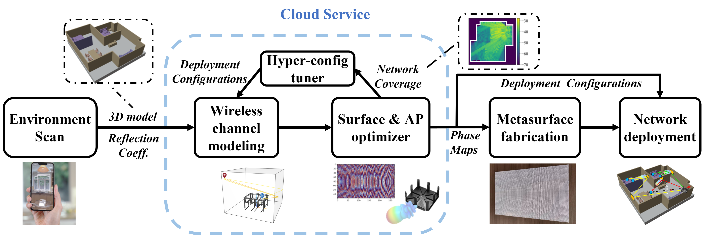
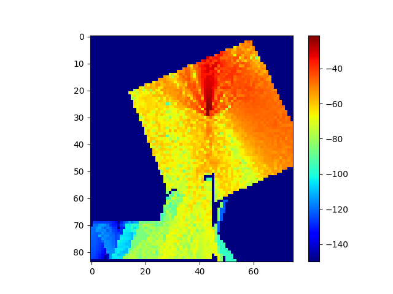
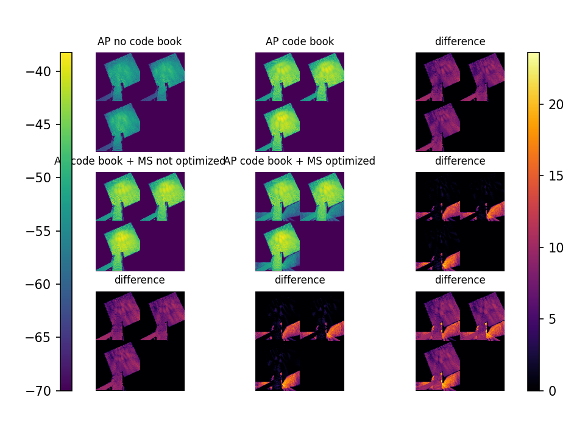

# AutoMS [Mobicom'24]

## What's this?

[UPDATE] We share the HFSS design file of our metasurface element design in `hardware/mmwave_rings_open_souce.aedt` (HFSS version: 2022R2)

This repository presents the software implementation of the paper <br/>
> **[AutoMS: Automated Service for mmWave Coverage Optimization using Low-cost Metasurfaces](https://rui-chun.github.io/uploads/automs-final.pdf)**\
> Ruichun Ma\*, Shicheng Zheng\*, Hao Pan, Lili Qiu, Xingyu Chen, Liangyu Liu, Yihong Liu, Wenjun Hu, Ju Ren \
> *ACM International Conference on Mobile Computing and Networking (**MobiCom**), 2024* 

It includes the code for the optimization framework (hyper-config tuner and phase map tuner), and wireless channel/coverage simulator.

A Linux computer with at least GPU GTX1650 is needed to run the wireless channel simulator without metasurface and an NVIDIA GPU with over 16G memory is needed to run full optimization.



## Files

- `fig/`: Figures showed in this doc.
- `optix/`: Slightly trimmed optix library
- `output/`: output folders generated when optimizing metasurface
- `stl/`: folders providing different scenes.
- `bf`: build fix script. There is a high probability of linking errors when compiling, use this script to fix it.
- `channel.png`: Simulation output. Signal coverage heatmap.
- `cudaMemManager.h`: Used to check if there is any cuda memory that has not been freed.
- `go.py`: Apart from the core ray tracing, almost all the rest of the functionality is implemented here.
- `optixPathTracer.cpp`, `optixPathTracer.h`, `optixPathTracer.cpp`: Core code files, including ray tracing, channel modeling, and other basic functions.
- `physical_exp_nni_main.py`: nni script, used to search for best metasurface placement.
- `physical_exp_nni_model.py`: Given the placement of the metasurface, output the optimization results.

## Environment Requirements

**CPU:** No explicit requirements, but should be able to run the required software.

**RAM:** At least 8~GB

**Nvidia GPU**:

A CUDA-enabled GPU

If you simulate without the metasurface, A normal gaming laptop with `GTX1650' will be sufficient.

To run channel simulation and joint optimization with metasurfaces, an NVIDIA GPU with over 16~GB memory is required.

**Software**

Linux based operating system with latest conda and Nvidia driver (version number `470` or later). We use Ubuntu `20.04` and Miniconda `23.3.1`.

## Build Project

- Create Conda environment and activate it

```shell
conda create -n optix_env python=3.10
conda activate optix_env
```

- Install CUDA 11.7

```shell
conda install -c "nvidia/label/cuda-11.7.1" cuda-toolkit
```

- Install pytorch

```shell
conda install pytorch=2.0.1 pytorch-cuda=11.7 -c pytorch -c nvidia
```

- Install cmake (>3.18)

```shell
conda install cmake
```

- Install package

```shell
sudo apt install libglfw3-dev
```

- Create folder for build files and generate makefile.

```shell
mkdir build
cd build
cmake ..
```

- Compile the project. Run command below in `build`

```shell
make -j
```

- There may be linking issues. Run command below in project folder, then build again

```shell
./bf
```

- Install python packages

```shell
pip install matplotlib tqdm numpy-stl
pip install nni==3.0
pip install "nni[Anneal]"==3.0
```

## Simple example of wireless channel/coverage simulation

```shell
python go.py
```

Then user will obtain the channel information of the given environment, with the output file named `channel.png`.



To accomplish this, a Tx array and Rx array are specified in `go.py`. The Tx array generates the wireless signals, and then the signal strength of each Rx is calculated. Each pixel in the output image represents an Rx.

## How to run the phase map optimizer

Our optimization framework comprises a hyper-configuration tuner and a phase map optimizer for mmWave network deployment. 
The phase map optimizer operates as the inner loop, determining the phase configurations for the given hyper-configurations.

The phase map optimizer identifies the optimal phase configurations for metasurfaces and mmWave AP phased arrays to maximize the coverage objective function in a target environment. This optimization is based on the channel matrices provided by the simulator and the current hyper-configurations. 

Given all the configuration para except for the AP's codebook and metasurface's phase map, run the following command to optimize them.

```shell
python physical_exp_nni_model.py
```

The result will be generated at `output/`, with the gain comparisons and channel heatmaps included.



With our hardware setup, it takes about 140s with A100 GPU.

## How to run the hyper-config tuner

Hyper-configurations are high-level deployment parameters, such as the quantity, dimensions (element count), and locations of metasurfaces, as well as the orientation(s) and location(s) of AP(s). 
AutoMS allows for the optimization of certain deployment configurations based on the specific scenario and user preferences, while users can manually set the remaining according to their requirements. 
Various algorithms can optimize these configurations; our implementation employs simulated annealing from NNI.

The hyper-configuration tuner, informed by the phase map optimizer's performance metrics, iteratively explores and updates configurations.

`physical_exp_nni_main.py` is the code for hyper-tuner, it is the outer optimization loop, using NNI to run `physical_exp_nni_model.py` multiple times. Check nni console and you'll see current best result.

Set `SINGLE_RUN` to `False` in `physical_exp_nni_model.py`, then:

```shell
python physical_exp_nni_main.py
```

It may take many iterations (hours) to converge to a good result, depending on how many iterations you set with NNI.

## Evaluation and expected results

The output expected from the experiment is already in the repository.

`channel.png` shows the result of the signal distribution without placing any metasurface.

`output/` folder contains the gain comparisons and channel heatmaps. In `output/*/optimization_result.png`, significant gains should be seen. `output/*/ms_and_codebook.pt` stores optimized metasurface phase map and codebook of AP, which will be applied in hardware experiment.

## Experiment customization

To customize, mainly modify the if `__name__ == "__main__":` section of `go.py`. The following changes are made in this section.

### Wave Length

Adjust `wave_len` parameter of `build_channel()` to set wavelength. Unit: m. Default value in `go.py` is `3e8 / 60e9`.

### Max Reflection Num

Adjust `max_reflection` parameter of `build_channel()` to set wavelength. Default value in `go.py` is `4`.

### Launch Size

Adjust `launch_x` and `launch_y` parameter of `build_channel()` to trade off simulation accuracy and running time. 

`launch_x*launch_y` represents the number of rays emitted by each antenna of a phased array. Since neighboring antennas share the path during simulation, the effect is equivalent to a pair of antennas with a larger launchesize.

### Position of Tx/Rx Array

Use `gen_pos_matrix()` or `gen_pos_from_endpoint()` to generate positions for Tx/Rx. See comments for details.

`src` parameter of `build_channel()` refers to positions of all Tx elements. `dst` parameter of `build_channel()` refers to positions of all Rx elements.

See comments of functions for more related customizations.

### Scene

Set `scene_folder` parameter for `build_channel`. `scene_folder` should be a folder containers all files to decribe a scene.

**Structure:**

- `wall.txt`: The top left, bottom left, and bottom right coordinates of walls where the metasurface can be placed.

- `mat.txt`: Stores the value of reflectivity from 0° to 90° for each material. Some items here use estimated constant values.

- `<object_name>_<material type>.stl`: stl files of all objects in this scene. `<material type>` should be defined in `mat.txt`.


### Citation

If you found this repository useful, please consider citing the paper:

```bibtex
@inproceedings{ma2024automs,
  author    = {Ruichun Ma, Shicheng Zheng, Hao Pan, Lili Qiu, Xingyu Chen, Liangyu Liu, Yihong Liu, Wenjun Hu, Ju Ren},
  title     = {AutoMS: Automated Service for mmWave Coverage Optimization using Low-cost Metasurfaces},
  booktitle = {ACM International Conference on Mobile Computing (MobiCom)},
  year      = {2024},
  doi       = {https://doi.org/10.1145/3636534.3649347},
}
```


